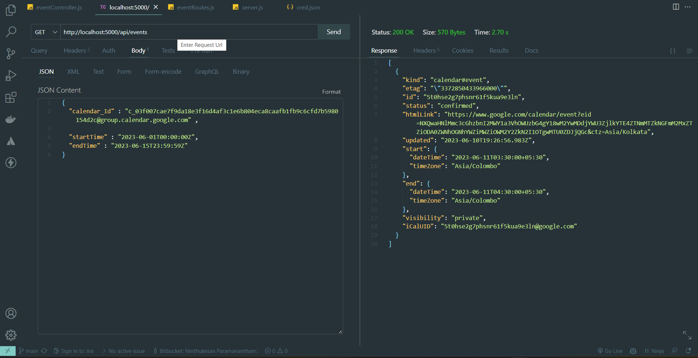
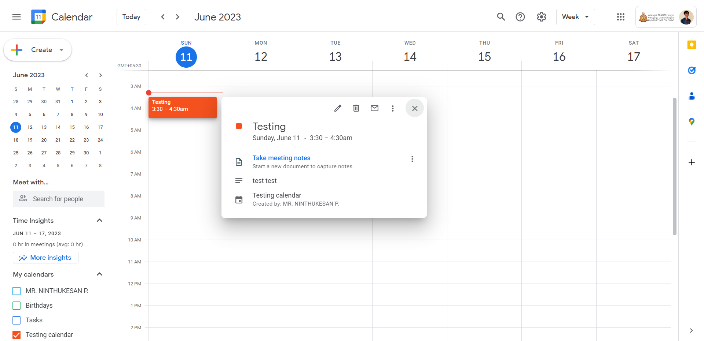

# Google Calendar API Integration

This is the backend program for to fetch the busy intervals in a given period of time which shared in the Google calendar.

## Requirements

- **NodeJS**
- **ExpressJS**
- **Create Google Cloud Project and Enable Google Calender API**
- **Add the variables and configurations of your Google Cloud Project**

## Note

There is **cred.json** file. If you are going to run, It is better to use your own configured json file with your credentials.

### Click the following link for the [Reference]("https://developers.google.com/calendar/api/quickstart/nodejs")

## Output

Check for below Screenshots as the reference of the **output**.

